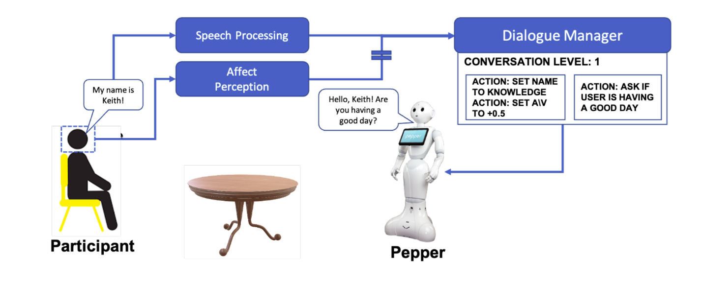
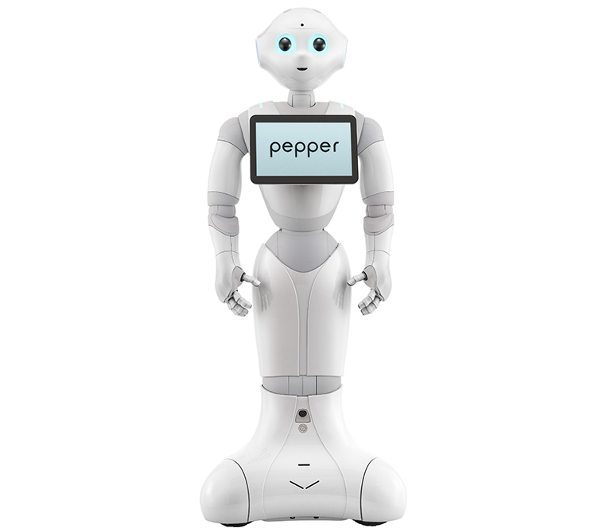
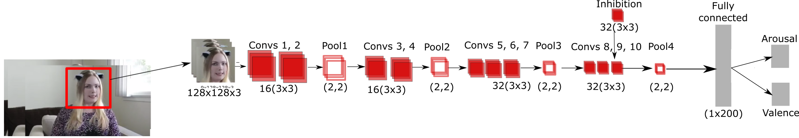
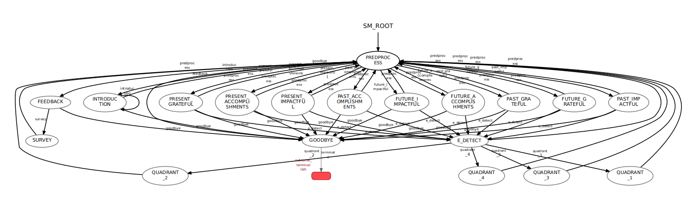

<br />
<p align="center">
  <a href="https://www.cl.cam.ac.uk/~hg410/people.html">
    
  </a>
</p>

<p>&nbsp;</p>

# Mental Well-being Robot Coach with Pepper Robot

This repository holds the source code for the Mental Well-being Robot Coach project that is created in the Affective Intelligence and Robotics Lab (AFAR Lab) in the University of Cambridge. The main idea is to test the effects of Continual Learning in social robots' interaction.

<br />
<p align="center">
    
  </a>
</p>

<p>&nbsp;</p>


## Pepper Robot



SoftBank's *Pepper Robot* is used for testing and experiments.

For controlling the robot, **Python 2.7** is used with the official library of the<br>SoftBank, **NAOqi 2.5.7**.

Robot can be used either with the official simulation software of the SoftBank,
 **Choregraphe**, or with the physical robot itself.

<p>&nbsp;</p>
<p>&nbsp;</p>
<p>&nbsp;</p>

## FaceChannel

Project uses the **FaceChannel** neural network that is a light-weight neural network to recognize emotion from facial expressions with much fewer parameters than common neural networks.




<br>

### Related Publication

```sh
P. Barros, N. Churamani and A. Sciutti,  "The FaceChannel: A Light-Weight Deep Neural Network for Facial Expression Recognition.," in 2020 15th IEEE International Conference on Automatic Face and Gesture Recognition (FG 2020) (FG), Buenos Aires, undefined, AR, 2020 pp. 449-453.
doi: 10.1109/FG47880.2020.00070
keywords: {emotion recognition;deep learning}
url: https://doi.ieeecomputersociety.org/10.1109/FG47880.2020.00070
```

### [GitHub repo of the FaceChannel](https://github.com/pablovin/FaceChannel)

<br>

## Script

The script that contains dialogue scenario and is implemented to the demo state machine can be found in *SCRIPT.pdf* file. During the development of the script, various psychologists helped the process.

<br>

## Smach

Project utilizes a Python library named **Smach**. This allows us to develop a state machine structure to implement the script easily. Below is the structure of the demo state machine:



A custom state machine can be created and used for different purposes.

<br>

## Requirements

Essentials:

* Install all the libraries in the requirements.txt file.

* Install CUDA 9 ([Instructions](https://github.com/akirademoss/cuda-9.0-installation-on-ubuntu-18.04))

* Install **ROS (Robot Operating System)**
  
  >*ROS Melodic* with *Ubuntu 18.04* preferably

* Install **NAOqi** Python SDK ([Download link](https://developer.softbankrobotics.com/pepper-naoqi-25-downloads-linux))

  >*NAOqi 2.5.7* preferably

To use Choregraph simulation:

* Install **Choregraphe**

To display view Smach states live:

* Install **smach_viewer** ([Documentation Link](http://wiki.ros.org/smach_viewer)) ([Tutorial](http://wiki.ros.org/smach/Tutorials/Smach%20Viewer))

  To use smach_viewer, uncomment lines that contain **sis** from *state_manager.py*

<br>

## Instructions

🎥 To watch the video about the technical details of the project, [click](https://drive.google.com/file/d/1NOUQQdYElSrAGtRTWOEKKw_PDEQ6Fkng/view?usp=sharing).

After installing ROS, a workspace and then a package should be installed. For advanced guide, see:

:warning: ROS package name should be *'dialogue_manager'*. Otherwise, change the name from the project files.

* [Creating a ROS workspace](http://wiki.ros.org/catkin/Tutorials/create_a_workspace)

* [Creating a ROS package](http://wiki.ros.org/ROS/Tutorials/CreatingPackage)

After creating the package, put the project files inside the *dialogue_manager* folder into the ROS package's folder, and inside the *catkin_ws* folder, run:

```sh
$ catkin_make
```

<br>

Demo state machine is created to test three different conditions, where the first condition implements only the script for interaction, the second condition uses FaceChannel for emotion detection and third one use the Continual Learning model for personalization.

The condition is selected randomly in the *state_manager.py*

To define the **IP** and **PORT** values of the robot, use *config.txt*. (The file can be modified with different values, but the order should be covered to run the demo.)

For most of the computers, setting **MICROPHONE_NAME** to 'default' in *config.txt* would work. To find all microphones' names, run this:

```python
import speech_recognition as sr
print sr.Microphone.list_microphone_names()
```

<br>

### Launch files

There are two launch files in the project:

1. **ComputerDialogueManager.launch**: To run the project using computer's own camera and speakers, use this file.

2. **PepperDialogueManager.launch**: To run the project using the Pepper Robot itself, or with the Choregraphe's simulation, use this file.

To run the demo, just type

```sh
$ roslaunch dialogue_manager PepperDialogueManager.launch session:=experiment_1 name:=atahan save_frames:=1
```

Launch files' arguments:

* *session* is the name of the session that will be used in the name of the log files and frames' main folder. Same session name **can** be used for different sessions. Default is 'Experiment'

* *name* is the user's name who will interact with the robot. Default is 'User'.

* *save_frames* determines whether the camera output frames will be saved or not. If the given value is **1**, it saves all the frames in the session folder. Default is 0.

The log files and frames can be found in the session folder that is located in *dialogue_manager/src/SessionReports*. The folder will be created after first run.

<br>

### Log Files

After each session, three logs files are created:

* *arousal_valence.log* is the file that holds the arousal-valence values of each frame with timestamps. The calculations are made with the FaceChannel framework.

* *flow.log* holds a table that shows all the dialogues of the robot and the user with timestamps. The table can be easily converted to other formats.

* *main.log* holds all events from all files with timestamps


<br>

## Contact

[](mailto:hg410@cam.ac.uk)
[](https://www.linkedin.com/in/hatice-gunes-05ab628)

[](mailto:nc528@cam.ac.uk)
[](https://www.linkedin.com/in/nikhilchuramani)

[](mailto:mwa29@cam.ac.uk)
[](https://www.linkedin.com/in/minjaaxelsson/)

[](mailto:atahan.caldir@ozu.edu.tr)
[](https://www.linkedin.com/in/atahancaldir/)

